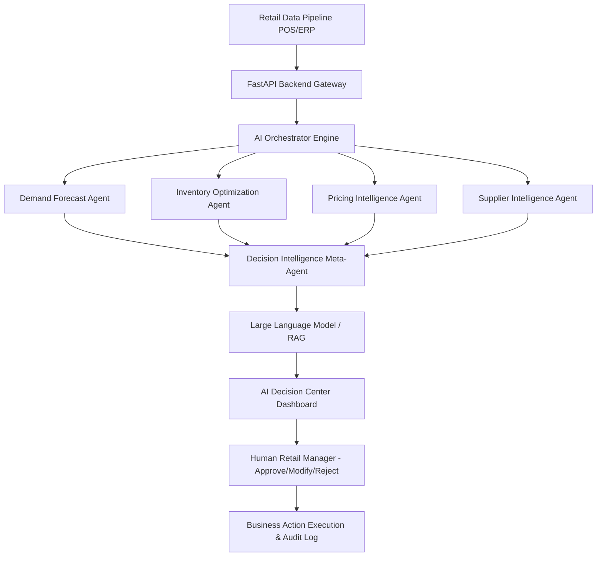
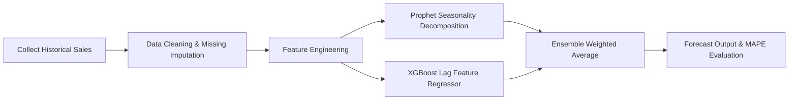
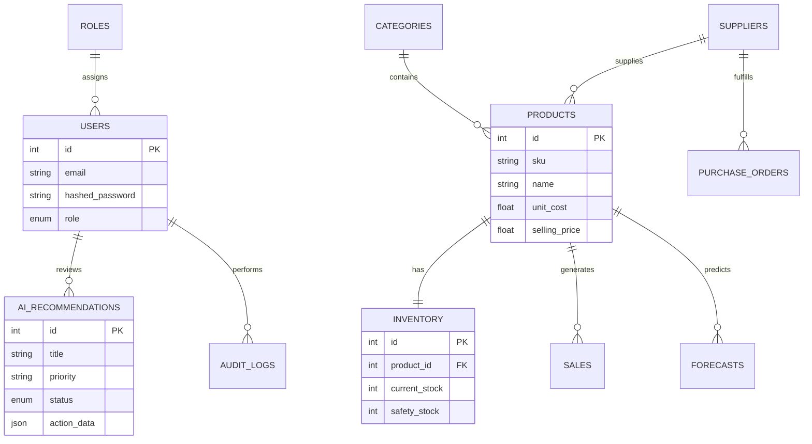

# RetailMind AI — System Architecture & Design Specification

> **An Agentic Retail Decision Intelligence Platform**  
> *Powered by FastAPI, React, Prophet, XGBoost, LangGraph, and RAG (Qdrant + LLM)*

---

## 1. Executive System Overview

RetailMind AI is an enterprise-grade AI decision intelligence platform for retail business decision-makers. Unlike conventional inventory software that simply logs stock counts, RetailMind AI applies a **Multi-Agent AI System**, **Machine Learning Ensemble Forecasting**, and **Retrieval Augmented Generation (RAG)** to analyze store performance, forecast demand, optimize pricing, evaluate suppliers, and present explainable business recommendations.

---

## 2. Multi-Agent System Architecture

The AI layer is structured as a **LangGraph Directed Acyclic Graph (DAG)** of specialized domain agents coordinated by an **AI Orchestrator**.

### Agent Roles & Responsibilities

| Agent Name | Specialization | Underlying Technology | Output |
| :--- | :--- | :--- | :--- |
| **Demand Forecast Agent** | Time-series demand prediction, festival/event impact modeling | Prophet + XGBoost Ensemble | 30-day demand predictions & upper/lower confidence bands |
| **Inventory Optimization Agent** | Dynamic safety stock calculation, reorder point triggers, stockout prevention | SciPy / Custom Heuristics | Safety stock targets, reorder quantities, overstock flags |
| **Pricing Intelligence Agent** | Competitor price tracking, price elasticity, margin target optimization | Price Elasticity Regression | Optimal price points, recommended discount percentages |
| **Supplier Intelligence Agent** | Supplier reliability scoring, lead-time tracking, risk mitigation | Multi-Criteria Scoring (AHP) | Supplier ranks, optimal vendor order splits |
| **Decision Intelligence Agent** | Conflict resolution between agents, synthesis of single explainable action | LangChain / GPT-4 / Gemini | Prioritized decision cards with confidence scores & expected ROI |

---

## 3. Machine Learning & Forecasting Workflow

### Feature Engineering Details
1. **Temporal Features**: Day of week, Month, Weekend indicator, Quarter.
2. **Lag Features**: 7-day, 14-day, and 30-day historical lag sales.
3. **Rolling Statistics**: 7-day rolling mean and 7-day rolling standard deviation.
4. **Festival Calendar Features**: One-hot encoding for major Indian retail festivals (Diwali, Holi, New Year, End of Season Sales).

---

## 4. Human-in-the-Loop (HITL) Workflow

RetailMind AI enforces strict **Human-in-the-Loop oversight**. The AI agents **never** automatically modify production prices or dispatch purchase orders.

1. **AI Synthesis**: Decision Agent generates structured recommendations.
2. **Dashboard Delivery**: Manager views the action in the **AI Decision Center**.
3. **Manager Decision**: Manager clicks **Approve**, **Modify**, or **Reject**.
4. **Reinforcement Feedback**: Manager decisions and notes are saved to `audit_logs` and used to fine-tune future recommendation heuristics.

---

## 5. Database Entity Relationship (ER) Diagram

---

## 6. Security & Authorization

- **Authentication**: OAuth2 with Password Bearer flow & JWT Tokens (HS256 signature).
- **Role-Based Access Control (RBAC)**:
  - `Admin`: Access to full system settings, user management, and API keys.
  - `Retail Manager`: Can approve/reject AI recommendations and manage purchase orders.
  - `Business Analyst`: Read-only access to analytics, forecasting reports, and charts.
